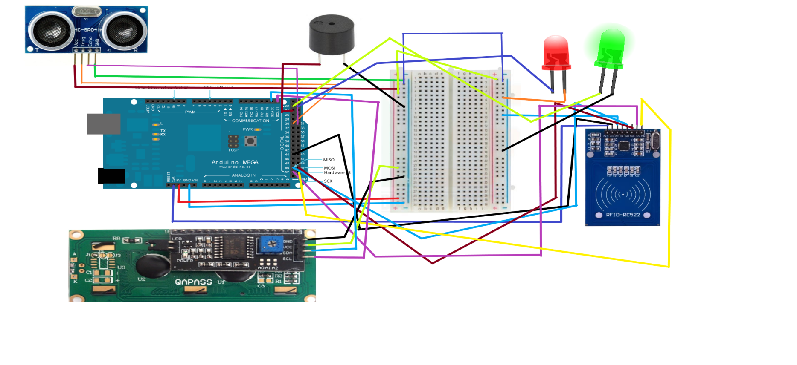
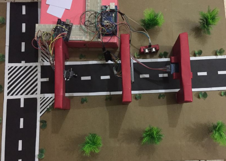
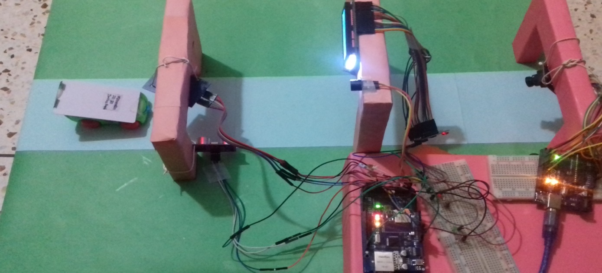
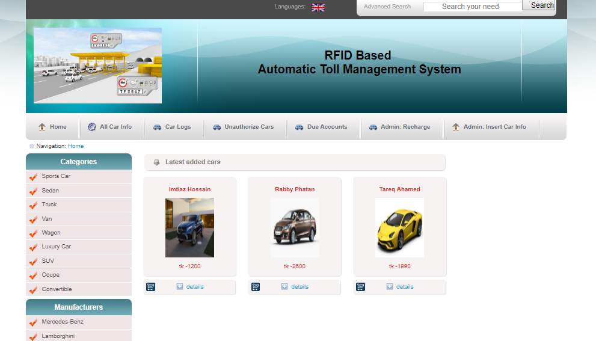
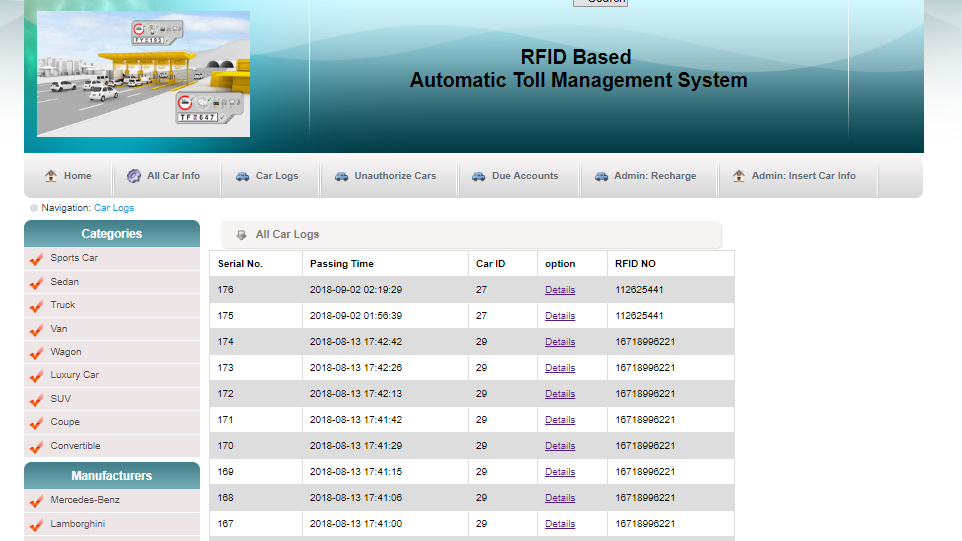
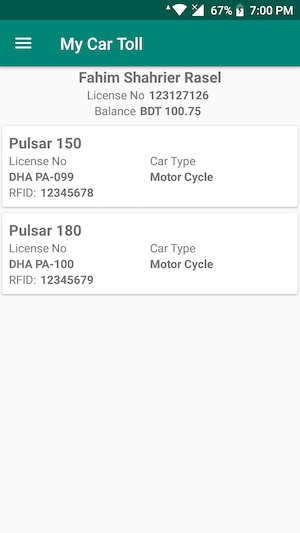
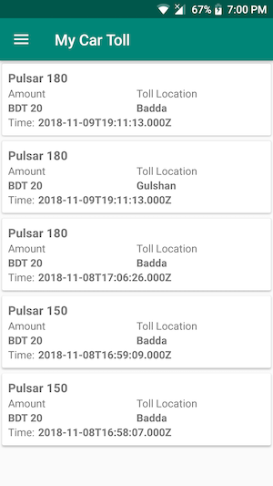

# IOT Based Automated Toll Collection System using RFID Technology

Collecting toll manually is time prune work and caused jam in the high ways and in the city. If the system can be automated then time and hassle can be reduced. On automated toll collection system both times and the traffic jam can be reduced. In our project, we made a small scale automated toll collection system. This project used IOT to solve the problem with the PHP based server and android application and node js based API for android application.

For IOT we have used

* Arduino Uno
* Arduino Mega
* Arduino Ethernet Shield
* RFID (RC522) Sensor and Cards
* Arduino Camera OV7670
* 16 * 2 LCD Display
* IIC/I2C Serial Interface Module
* Ultrasonic Sonar Sensor
* Buzzer
* LED Lights

For Backend Server we used:

* PHP 7.0
* MySQL

For API:

* Node.js
* Express

## Ardino Connection with sensor and other elements

##  Full Environment

## Web Frontend

## Android Application

 

 

